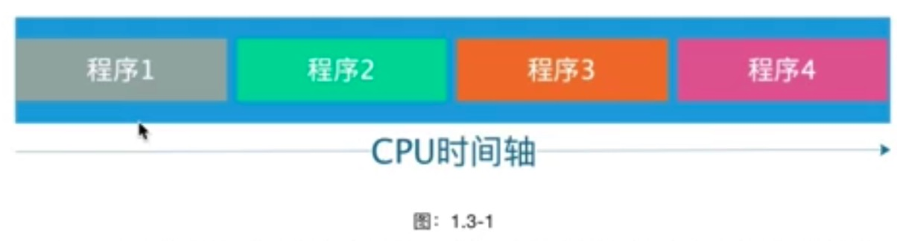
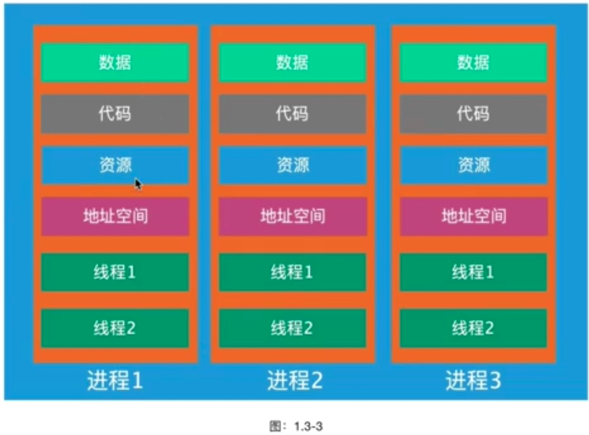
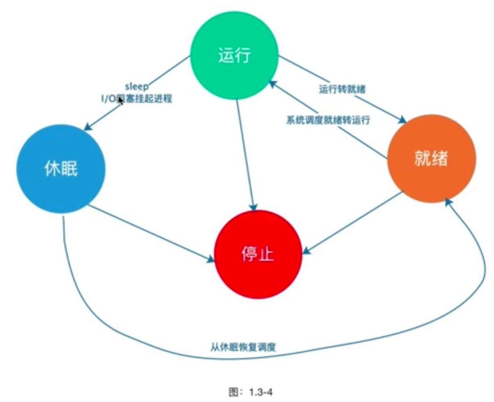
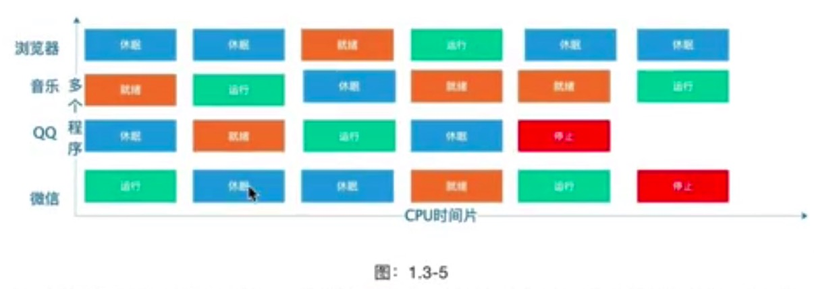
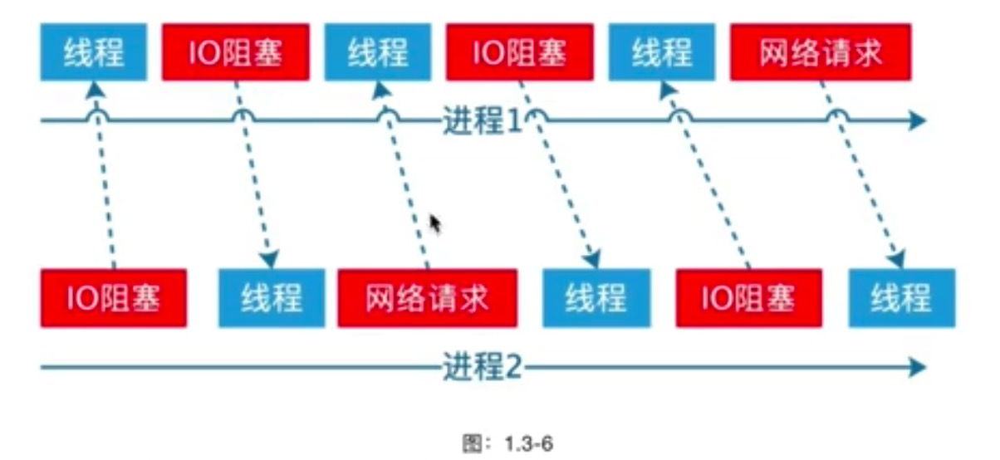

# 进程

在人类刚发明计算机的时候，只能同时处理一件事情。我们通常说程序的设计来自于现实的人类世界，这个
进程同样也是。

图1.3-1是早期计算机的多程序执行流程，我们可以看到在-个CPU的生命周期里面，多个程序是顺序执行
的。后面的程序什么时候执行取决于前面的程序什么之后执行完。如果当前执行的程序进行IO时，CPU也只
能等待，CPU的使用率极低。如果当前执行的程序占用CPU时间很长，其他程序得不到CPU的执行权，只能
卡着不动。

基于上面说的单进程有很多的缺点，所以出现了多道程序技术，使得程序可以并发执行。从上图可以看出来
多道程序设计把CPU分成了时间片，可以在单CPU的情况下实现并发。CPU以人无法感知的速度在不停切换
执行不同的程序，这样让我们看起来像是多个程序同时在执行。

从图1.3-3我们可以看到了每个进程有自己独立的内存、地址空间、数据栈等等，每个进程都跟其他进程互不
干扰，这就是为什么有些人在写代码都时候，说定义了一个全局的属性，但是一个进程改变了，另一个进程
读取却没有变化，这就是原因，每个进程有自己的独立堆栈，内存资源等。

## 进程状态

在图1.3-4里面可以看到进程有不同的状态，当进程在不同状态进程处于就绪态的时候就是等待操作系统进行
调度。前面我们提到过进程的切换，CPU不断的切换到不同的进程来执行，当CPU调度别的进程当前执行的
进程怎么办呢?下次再调度会这个进程的之后怎么知道代码执行到哪里，都有什么数据呢?其实当CPU调度
别的进程的时候，会保存当前执行进程的信息、状态，这种操作叫做上下文切换。一个进程从运行态转到休
眠状态的时候，进程的现场会保存到该进程的内核栈，当这进程再次进入就运行状态的时候，CPU从这个进
程的PCB内核栈读取这个现场信息恢复进程。

多道程序设计把CPU执行的时间分割成了很小的时间片，由操作系统在不同状态的进程进行调度。但是在一
个核心CPU一次只能处理一件事情， 只是因为每次切换的时间太快了，让我们认为是-起执行的。

## 上下文切换

当一个进程遇到阻塞的之后CPU就会切换到另一个进程执行,避免在在进程阻塞的时候浪费CPU资源。

> 进程不是越多越好，进程过多在上下文切换过程中浪费大量的CPU可执行时间
> 并发与并行的区别:并发是某一个时间段做多少事情，并行是同一时刻同时做多件事情

## 孤儿进程

前面说过了，计算机模拟的是人类世界,那么这个孤儿进程跟我们人类世界一样，没有父母没有监护人的为
孤儿。孤儿进程产生的原因是父进程终止执行了，但是子进程依然在执行的子进程就被叫做孤儿进程。

## 僵尸进程

僵尸进程产生的原因是因为子进程终止之后父进程没有对其进行回收，子进程的进程描述符依然保留在系统
当中，所以产生了僵尸进程，僵尸进程对于操作系统是有资源浪费的。所以务必避免出现僵尸进程，解决办
法可以在父进程调用wait或者waitpid解决。

## 守护进程

在Linux操作系统里面我们想要实现关闭终端之后还可以运行，我们通常采用

- nohup
- setsid
- 命令后面加 &

这几种方式，我们想想在前面说过的孤儿进程好像就可以是现在这样的功能。我们只要父进程退出执行，子
进程还是依然会执行的。这就是我们通过故意产生孤儿进程来实现守护进程的功能。

