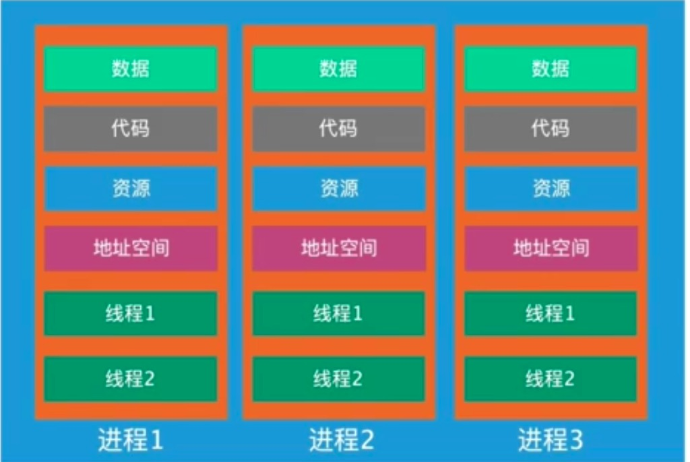
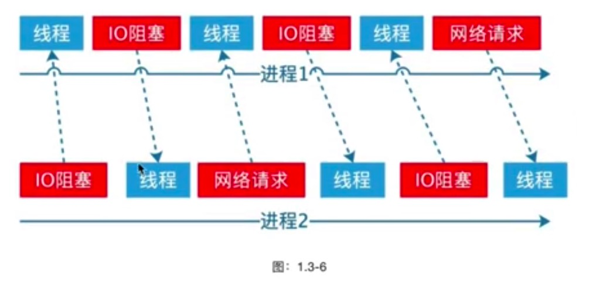
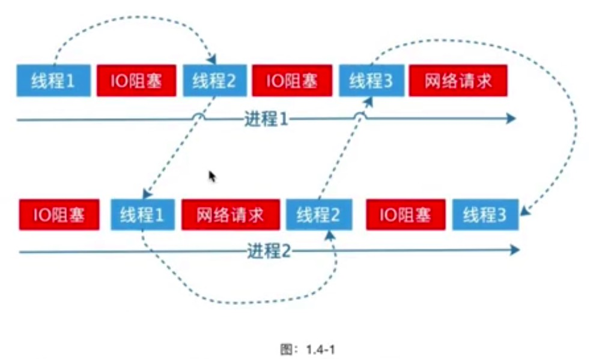

# 线程

线程与进程有很多类似的地方，但是也有部分不一样。在讲进程的时候我们给大家看过一张图。

从图: 1.3-3 中可以看出来线程是在进程内创建的，也就说多个线程共享一个进程内的资源; 包括内存、地址
空间、文件描述符等等。使用多线程是无序执行的，线程的调度和进程一样，由操作系统来调度，因此什么
时候执行我们并不知道。有一句话可以概括线程：线程就是更轻量的进程。

## 线程

- 一个进程至少有一个线程
- 同一个进程内的多个线程共享同一份资源
- 文件描述符表
- 信号处理方式
- 当前工作目录
- 内存地址空间

每个线程有自己的独立栈，也就是线程内部的变量其他线程拿不到，除非是在进程内的全局变量。
既然有了多进程为什么我们还需要多线程？进程在遇到 IO 会阻塞，后面的代码无法执行，这时候CPU处于空
跑状态，为了充分的利用 CPU,操作系统会自动把遇到 IO 阻塞的进程挂起，切换到其他进程。

## 进程上下文

## 线程上下文

操作系统会给每一个进程分配给可用的时间片，就是每个进程每次运行多久，例如: CPU 给每个进程分配了
 10ms 的时间，如果一个进程执行到 3ms 的时候发生 了 IO 阻塞怎么办呢?在单线程的情况下，会被切换到另一
 个进程，当前进程会被挂起。而多线程呢，是尽可能的利用完 CPU 给这个进程分配的时间片。
举个“栗子”，微信我们大家都在用，微信很显然就是-个多线程程序，为什么这样说呢?我们在跟别人视频
的时候同时还可以跟其他人聊天，还可以使用输入法输入文字，选择表情，如果只有一个线程，那么我们在
跟别人视频的时候这个线程就会阻塞，我们看到微信的界面就会卡死。
一个线程遇到阻塞的时候，会在同-个进程内的其他空闲线程切换，这样的切换只要消耗线程栈开销，因此
很多时候我们都说线程是轻量级的进程。
因此需要把-个进程 里面的任务再次分割成任务片，类似 CPU 分出来的时间片一样，分成多少份就开多少个
线程。
