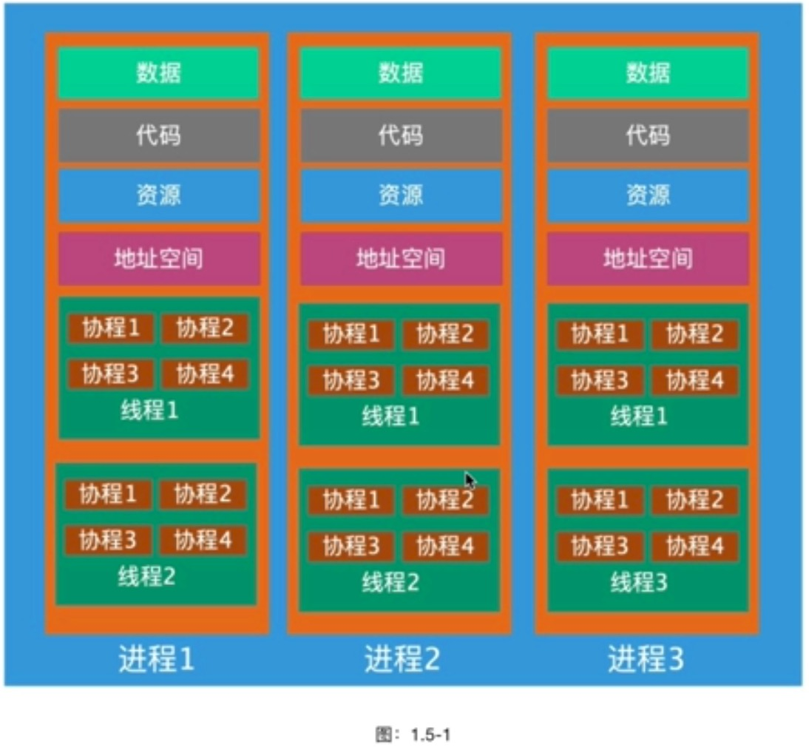
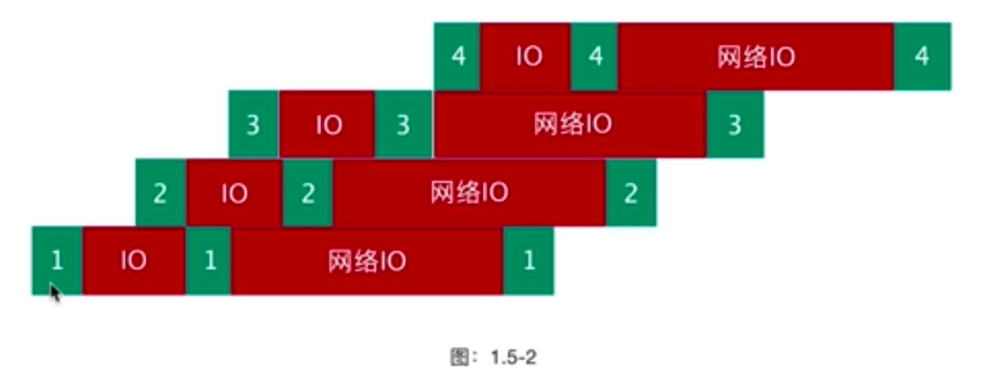
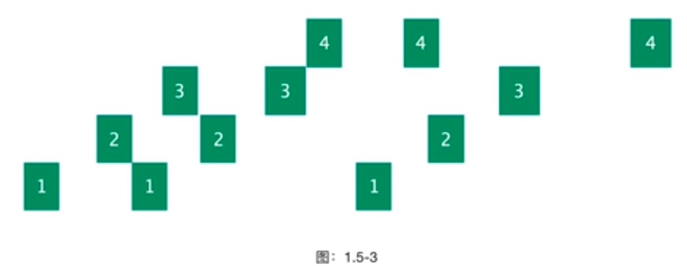
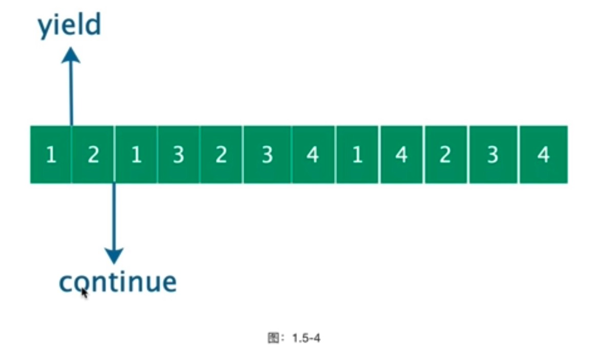
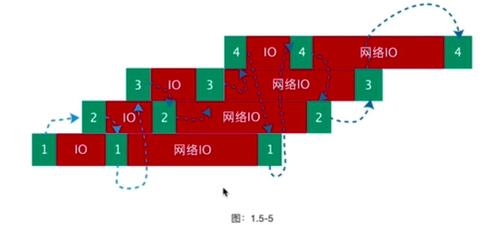
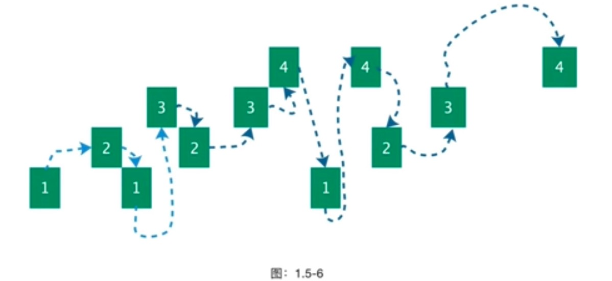
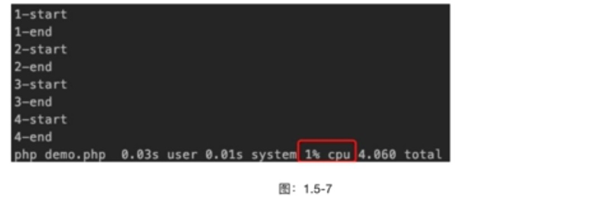

# 协程

协程说复杂不复杂说难也不难，一句话可以概括:能提高并发，但不能加速任务，同步代码实现异步 IO 异
步非阻塞的代码块。
协程是一种特殊函数，是一种可以挂起的函数，然后可以从挂起的地方重新恢复执行，一个线程内的多个协
程是串行的，跟 CPU 处理进程一样,同一时刻只能一个协程在线程上运行,除非出让了控制权给别的协程运
行。协程无法利用多核CPU因此协程只能解决并发问题，不能解决任务处理速度问题。协程就是把一个大任
务再分成更小的片段，封装程一个函数，当其中-个协程需要 IO 阻塞的时候，主动挂起当前协程，把控制权
交给其他协程运行。
我们知道进程和线程是由操作系统调度的，什么时候执行取决于操作系统什么时候把 CPU 时间交给某个进程
或者线程，而协程是什么时候交出控制权是由用户决定的。进程和线程属于内核态，协程属于用户态线程。
协程是一种用户态的轻量级线程，协程的调度完全由用户控制。协程拥有自己的寄存器上下文和栈。协程调
度切换时，将寄存器上下文和栈保存到其他地方，在切回来的时候，恢复先前保存的寄存器上下文和栈，直
接操作栈则基本没有内核切换的开销，可以不加锁的访问全局变量，所以上下文的切换非常快。

## 协程特点

- 用户态线程、遇到 IO 主动让出控制权
- 多个协程代码依然是串行的，无需加锁
- 开销低，只占用内存，不存在进程、线程切换开销
- 并发量大，单个进程可开启 50w 个协程
- 随时随地，只要想并发，就调用 `go()` 创建协程



我们知道线程是轻量级的进程，那么协程就是轻量级的线程。协程运行在线程之上，一个线程可以有多个协
程。
我们知道在进程遇到阻塞的时候开多-个线程在进程内部切换，避免每次都切换进程,这样可以更大力度的
使用 CPU 分给这个进程的可使用时间。而协程跟线程和进程的关系很类似，只不过协程是跟线程直接建立关系



图: 1.5-2 是多个线程之间切换的示意图，那么我们来考虑-下，如果线程只是等待 IO 操作(网络或者文
件)，那么为什么像线程重复使用进程-样来重复的使用这个线程呢?我们把 IO 去掉，看看这个图是什么样
子的。



去掉 IO 部分操作，可以看出来基本上这个并发请求应用程序代码可以在单个线程中运行，协程最大力度的
利用了线程等待 IO 的时间，让程序在等待 IO 的时候可以执行别的业务代码。



从图: 1.5-4 看着像不像-一个线程的执行流程，这就是协程的魅力所在，当-个协程被 yield 之后会被挂起，
把控制权转移给线程内部的其他协程，因为是在线程上进行的切换，所以开销远远比进程和线程低很多。



当程序调用协程之后，当前协程会主动让出控制权交给同一个线程内的其他协程处理，类似图: 1.5-5 所示，
开发者代码中需要使用 IO 的时候主动让出协程的控制权给别的协程使用。



去掉 IO 部分再看协程的处理，就跟图: 1.5-4 所示的一样，直接执行的都是业务逻辑，避免遇到 IO 导致线程转
换到等待状态，更充分的利用 CPU 分给这个线程的执行时间。

> 注意: 协程并不能让任务加速进行，只能执行更多任务。

协程由于是建立在线程之，上的，因此没有办法使用CPU多核心的优势，协程适合适用于IO密集运算的场景。

## 协程有什么作用?

协程是为了提高CPU使用率，避免在线程阻塞的时候大量的线程上下文切换。

go1.php

```php
<?php
echo "1-start\n";
sleep(1);
echo "1-end\n";
echo "2-start\n";
sleep(1);
echo "2-end\n";
echo "3-start\n";
sleep(1);
echo "3-end\n";
echo "4-start\n";
sleep(1);
echo "4-end\n";
```




go2.php

```php
<?php
Swoole\Runtime::enableCoroutine(true);
go(function () {
    echo "1-start\n";
    sleep(1);
    echo "1-end\n";
});

go(function () {
    echo "2-start\n";
    sleep(1);
    echo "2-end\n";
});

go(function () {
    echo "3-start\n";
    sleep(1);
    echo "3-end\n";
});

go(function () {
    echo "4-start\n";
    sleep(1);
    echo "4-end\n";
});
echo "main\n";

```

go3.php

```php
<?php
Swoole\Runtime::enableCoroutine(true);

go(function () {
    sleep(2);
    echo "go1\n";
});

go(function () {
    sleep(1);
    echo "go2\n";
});
echo "main\n";
```

go4.php

```php
<?php
Swoole\Runtime::enableCoroutine(true);
$chan = new Swoole\Coroutine\Channel();
// 模拟生产者
go(function () use ($chan) {
    echo "数据生成中....\n";
    sleep(1);
    $chan->push(['name' => 'sunny']);
    echo "数据生成完成....\n";
});

// 模拟消费者
go(function () use ($chan) {
    echo "等待消费....\n";
    $data = $chan->pop();
    print_r($data);
    echo "消费完成\n";
});
echo "main\n";
```