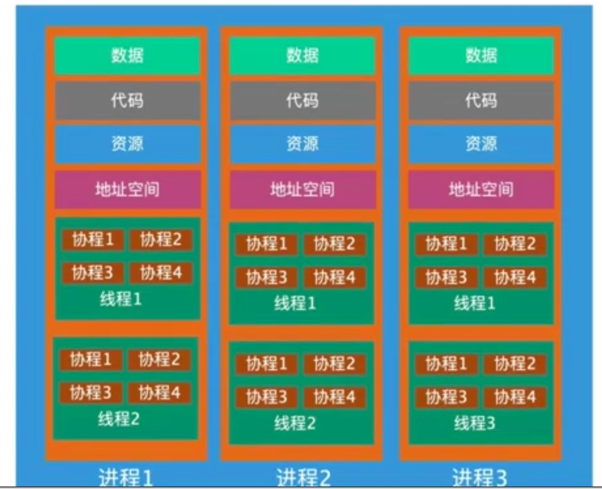
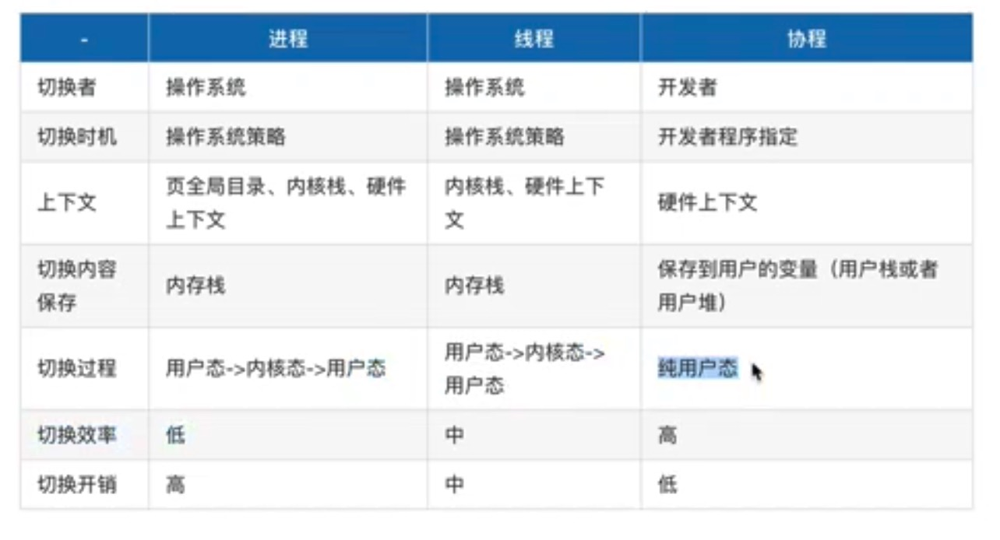

# 进程、线程、协程的区别

## 关系

为了更简单的理解它们之间的关系，我们依然举个“栗子"帮助大家理解进程、线程、协程。

原型 | 比喻
-|-|-
CPU | 工厂
进程 | 车间
线程 | 生产线
协程 | 工人

一个工厂里面会有多个车间，每个车间有自己独立的物料、电力供应，这就好比是进程，有自己的独立内存
地址和数据栈，开- -个车间的成本非常高，我们需要有足够的大小的厂房。在工厂物料和电力都有限的情况
下，一个车间开工其他车间就要停下来，这就类似上下文切换，所以这个切换是很浪费时间的。

一个车间场地允许的话可以直接多开几条生产线，这样成本就会比开一间车间要低得多，当我们一条生产线
不够用的时候可以多开几条生产线，就好比我们在程序开线程一样防止 -条生产 线中工作不过来堵在那里。

生产线，上的每一个工人都在协助完成一个产品的生成组装，前一个人把一个零件处理好了，然后交由下一个
人进行处理。如果有一个人处理不过来,很多零件都堆积在某-个人那的时候，流水线后面的工人等不到上
-个零件过来就没有办法继续返货,比如我们遇到了 IO 阻塞;当然狠心的老板不会让后面的工人闲下来，老
板就让后面的工人去做别的事情，反正就是不让你偷懒。

## 上下文切换对比

